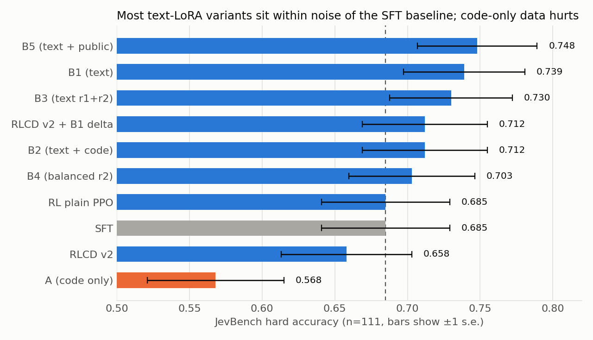
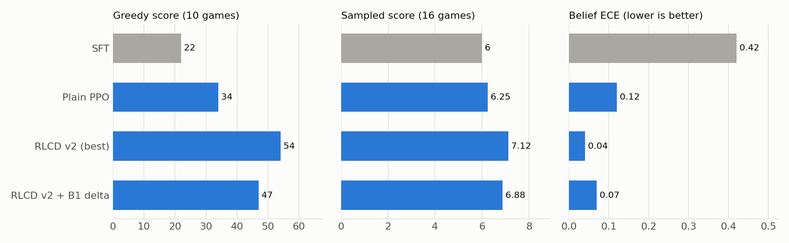

# decider-9b: Mapika's decider recipe on Qwen3.5-9B + a hard-decision data and RL study

This repo trains a decider-style decision model on **Qwen3.5-9B-Base** before trying to improve it for the hard tier on JEVBench via post-training.
Post-training includes LoRA fine-tuning on teacher-written data, and with calibrated RL on Breakout.

> **Credit.** The supervised recipe, data mixture, serving code and evaluation suite are
> [Mapika's decider](https://github.com/Mapika/decider), used under Apache 2.0. Base model: Qwen/Qwen3.5-9B-Base.
> Text-data teacher: Qwen/Qwen3.8-27B (Apache 2.0). No JevBench item was used for training or for choosing training data.

## Results

**Stage 1: decider's one-epoch "full" recipe on the 9B base** (1,555,599 examples, 464.6M tokens, 16,982 optimizer
steps, about 23 h on one GH200).

| | in-task acc | held-out acc | JevBench public all | hard | easy | original |
|---|---|---|---|---|---|---|
| decider9b-sft (this repo) | 0.843 | 0.793 | 0.840 | 0.685 | 1.000 | 0.972 |

decider-4b v2 scores 0.676 on hard (ECE 0.071) against 0.685 here (ECE 0.113). 

**Stage 2: LoRA on top of the SFT model, aimed at JevBench hard.**

| run | training data | hard | paired vs SFT (fixed / broken, sign test p) |
|---|---|---|---|
| A | 20k code-generated questions | 0.568 | 5 / 18, p = 0.011 (a real drop) |
| B1 | 9.4k questions written or reworded by Qwen3.8-27B | 0.739 | 11 / 5, p = 0.21 |
| B3 | B1 + 10k mined hard examples | 0.730 | 11 / 6, p = 0.33 |
| B5 | B1 text + public sets (GSM8K, ProofWriter, BBH, MuSR) | 0.748 | 15 / 8, p = 0.21 |

- Code-only data taught templates. Held-out accuracy on the generated families rose (long_policy 0.76 to 1.00) while JevBench hard fell by 11.7 points. 

- Teacher-written text avoided the drop and moved hard up by 4 to 6 points.

- Regression accuracy was kept for every run (within 0.003 of the SFT model). All LoRAs come out over-confident at T = 1 and are fine after fitting a temperature (about 1.6).

Full tables and settings: [`hardgen/EXPERIMENTS.md`](hardgen/EXPERIMENTS.md).

**Breakout RL with calibrated beliefs ("RLCD-style").** PPO on score plus a belief log score plus a KL penalty that
retains the SFT model, started from decider9b-sft.

| model | greedy (10 games) | sampled (16 games) | belief ECE |
|---|---|---|---|
| SFT | 22 | 6.00 | 0.42 |
| plain PPO | 34 | 6.25 | 0.12 |
| RLCD-style v2 (best) | 54 | 7.12 | 0.04 |

## Reproducing

1. Clone decider, apply the patches in order (`git apply patches/*.patch`).
2. Environment (Isambard-AI, GH200, aarch64, CUDA 12.7 driver): install with `-c env/torch-pin.txt --override env/overrides.txt`.
   Torch 2.11.0+cu128 is the newest build the driver accepts, and Triton **must** be 3.7.1: fla refuses the older builds
   on Hopper because they give wrong gradients, and uv will quietly downgrade it to 3.6.0 when resolving torch. Check
   `python -c "import triton; print(triton.__version__)"` after every install. Also set `FLA_TILELANG=0`.
3. `scripts/decider_data.sh`, then `scripts/decider_9b_full.sh` (chain a second link with
   `sbatch --dependency=afterany:<id>`; the resume support picks up where the first stopped).
4. `scripts/decider_9b_eval.sh`, then `scripts/jevbench_decider.sh`.
5. Stage 2: `hardgen/jobs/` (`train_loraB1.sh`, `train_loraB5.sh`, `rl_breakout_calibrated.sh`, ...).

The job scripts keep the original cluster paths (`/projects/<project>/...`), so edit them before reuse.

## Licence

Apache 2.0, the same as decider. See `LICENSE`.
